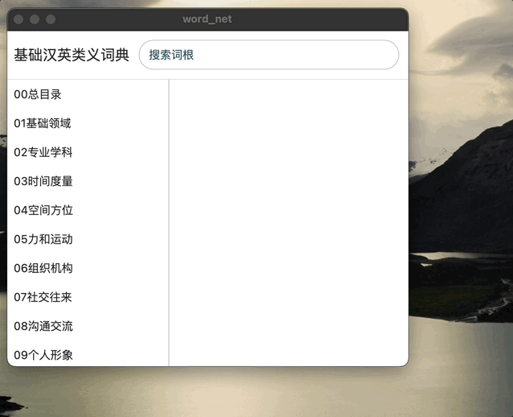

# word_net
---
基础汉英类义词典  

## 注意事项
项目中的数据来源于 https://publish.obsidian.md/thesaurus;  涉及到版权问题，请务必遵守[版权声明](https://publish.obsidian.md/thesaurus/%E8%8B%B1%E8%AF%AD%E8%AF%8D%E4%B9%89%E5%88%86%E7%B1%BB%E6%95%B0%E6%8D%AE%E5%BA%93%EF%BC%88%E5%A4%A7%E5%AD%A6%E7%89%88%EF%BC%89/0%E6%9C%AC%E8%B5%84%E6%96%99%E5%BA%93%E5%9F%BA%E6%9C%AC%E4%BF%A1%E6%81%AF/02%E7%89%88%E6%9D%83%E5%A3%B0%E6%98%8E)

仅供研究学习使用。

## Getting Started

This project is a starting point for a Flutter application.

A few resources to get you started if this is your first Flutter project:

- [Lab: Write your first Flutter app](https://docs.flutter.dev/get-started/codelab)
- [Cookbook: Useful Flutter samples](https://docs.flutter.dev/cookbook)

For help getting started with Flutter development, view the
[online documentation](https://docs.flutter.dev/), which offers tutorials,
samples, guidance on mobile development, and a full API reference.
